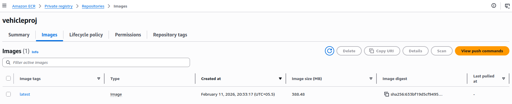
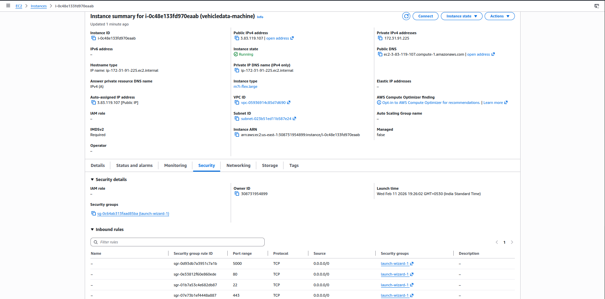
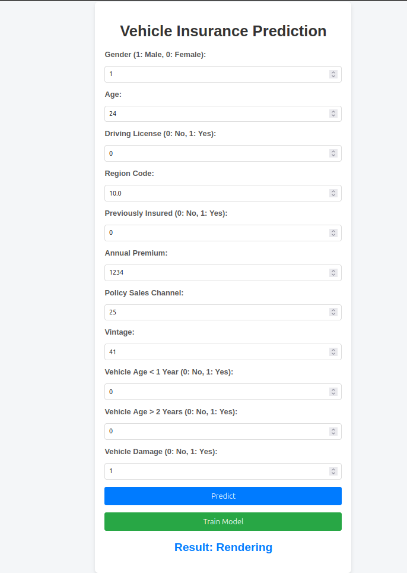
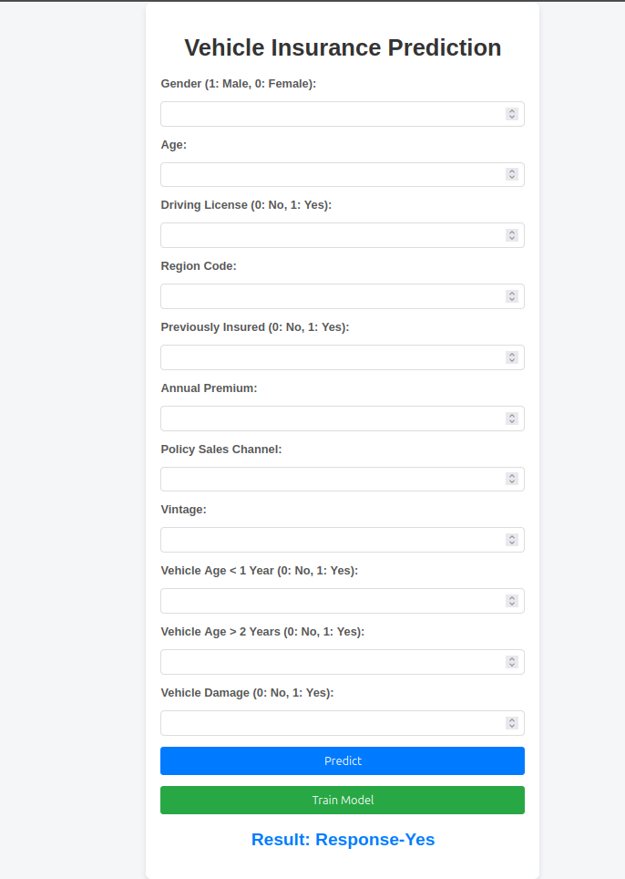
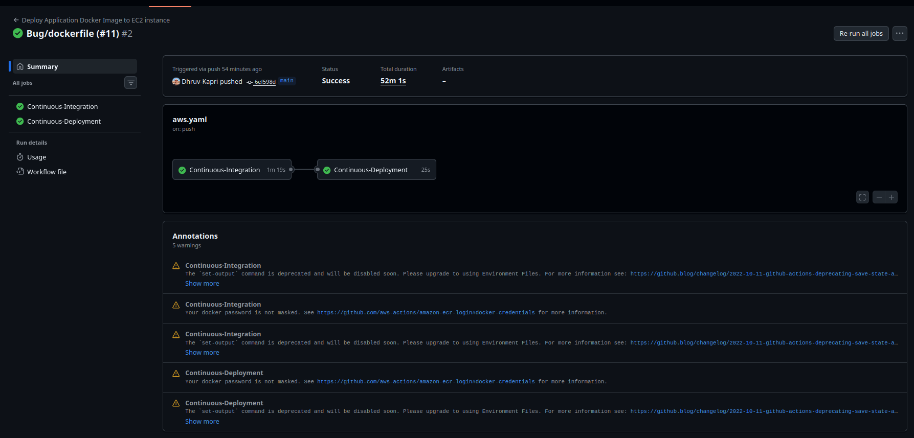

# Vehicle-Insurance-End-to-End-ML

An **end-to-end production-grade Machine Learning system** demonstrating a complete **MLOps lifecycle**:

> MongoDB → Data Pipeline → Model Training → Model Evaluation → AWS S3 Model Registry → FastAPI Inference → Docker → CI/CD → AWS EC2 Deployment

This project follows an **industry-aligned MLOps workflow** with **modular**, **scalable**, and **maintainable** code architecture.

---

## Live Architecture Overview

```text
MongoDB Atlas
      ↓
Data Ingestion Pipeline
      ↓
Validation → Transformation → SMOTEENN
      ↓
Model Training (Random Forest)
      ↓
Model Evaluation
      ↓
Model Registry (AWS S3)
      ↓
FastAPI Backend
      ↓
Docker Image (ECR)
      ↓
GitHub Actions CI/CD
      ↓
AWS EC2 Deployment
```

---

## Project Structure

```bash
Vehicle-Insurance-End-to-End-ML
├── artifact/                     # Generated artifacts (ignored in git)
├── backend/                      # FastAPI/Flask app entry points
│   ├── app.py                    # FastAPI entrypoint
│   ├── config.py                 # Path configuration
│   ├── forms/                    # Form parsing logic
│   ├── routes/                   # Train & Predict routes
│   └── services/                 # Prediction service layer
├── config/                       # YAML configs (schema, model)
├── frontend/                     # UI
├── logs/                         # Application logs (ignored in git)
├── notebook/                     # EDA & experimentation notebooks
├── src/                          # Core source code
│   ├── cloud_storage/            # AWS S3 integration
│   ├── components/               # ML pipeline components
│   ├── configuration/            # DB & cloud connections
│   ├── constants/                # Global constants
│   ├── data_access/              # MongoDB data access layer
│   ├── entity/                   # Config & artifact dataclasses
│   ├── exception/                # Custom exception handling
│   ├── logger/                   # Centralized logging
│   ├── pipeline/                 # Training & prediction pipelines
│   └── utils/                    # Utility functions
├── template.py                   # Project scaffolding script
├── Dockerfile                    # Docker configuration
├── .github/
│   └── workflows/
│       └── aws.yaml              # CI/CD workflow
├── pyproject.toml                # Local package setup
├── requirements.txt              # Python dependencies
└── README.md
```

---

## Completed Components

### Core ML Pipeline

- Data Ingestion (MongoDB → DataFrame)
- Data Validation (Schema-based)
- Data Transformation (Feature Engineering + Scaling)
- Class imbalance handling using **SMOTEENN**
- Model Trainer (Random Forest)
- Model Evaluation (F1-score comparison)
- Model Registry via AWS S3
- Model Pusher

### Backend

- FastAPI structured backend
- Layered architecture (Route → Form → Service → Pipeline)
- HTML frontend integration
- Static file handling

### MLOps

- Dockerized application
- GitHub Actions CI/CD
- AWS ECR integration
- EC2 self-hosted runner
- Automated deployment on push
- Production model pulled from S3

---

## ML Workflow Components

### 1. Data Ingestion Workflow

The **Data Ingestion component** performs the following steps:

1. Connects to **MongoDB Atlas** using environment variables
2. Fetches raw data from the target collection
3. Converts MongoDB documents into a `pandas.DataFrame`
4. Stores raw data in the **feature store**
5. Splits data into **train** and **test** sets
6. Saves ingested datasets as **artifacts**
7. Logs each step and handles failures gracefully

#### Artifacts generated:

```text
artifact/<timestamp>/data_ingestion/
├── feature_store/
│   └── data.csv
└── ingested/
    ├── train.csv
    └── test.csv
```

### 2. Data Validation Workflow

The **Data Validation component** ensures that ingested data strictly conforms to the schema defined in `schema.yaml`.

#### Validations Performed:

1. Validates **number of columns** against schema
2. Verifies presence of all **numerical columns**
3. Verifies presence of all **categorical columns**
4. Aggregates validation errors into a report
5. Blocks pipeline execution if validation fails

#### Artifacts generated:

```text
artifact/<timestamp>/data_validation/
└── report.yaml
```

### 3. Data Transformation Workflow

The **Data Transformation component** prepares data for model training using a combination of custom logic and sklearn pipelines.

#### Steps:

1. Loads validated train & test datasets
2. Separates input features and target column
3. Applies custom transformations:
   - Gender mapping (`Female → 0`, `Male → 1`)
   - ID column removal
   - One-hot encoding for categorical features
   - Column renaming & type casting
4. Applies scaling using ColumnTransformer:
   - `StandardScaler` for numerical features
   - `MinMaxScaler` for selected columns
5. Handles class imbalance using **SMOTEENN**
6. Concatenates transformed features with target labels
7. Saves transformation artifacts

#### Artifacts generated:

```text
artifact/<timestamp>/data_transformation/
├── transformed/
│   ├── train.npy
│   └── test.npy
└── transformed_object/
    └── proprocessing.pkl
```

### 4. Model Trainer Workflow

The **Model Trainer component** is responsible for training, and persisting the ML model using the transformed datasets produced by the **Data Transformation component** in the pipeline.

#### Steps:

1. Loads transformed train & test arrays (`.npy`)
2. Splits arrays into:
   - Input features (`X`)
   - Target labels (`y`)
3. Trains `Random Forest` models and evaluates if it's accuracy is greater than set threshold
4. Evaluates models using appropriate classification metrics
5. Persists the trained model as an artifact
6. Logs training metrics and model selection details

#### Artifacts generated:

```text
artifact/<timestamp>/model_trainer/trained_model
└── model.pkl
```

### 5. Model Evaluation Workflow

The **Model Evaluation component** is responsible for validating whether the newly trained model should replace the current production model.

#### Steps:

1. Loads holdout **test dataset**
2. Applies identical preprocessing logic used during training
3. Loads newly trained model artifact
4. Fetches production model from **AWS S3** (if available)
5. Computes **F1-score** for:
   - Newly trained model
   - Production model
6. Compares performance difference
7. Accepts model only if performance improves

### 6. Model Pusher Workflow

The **Model Pusher component** is responsible for promoting the accepted model to production by uploading it to AWS S3.

#### Steps:

1. Checks if model is approved by Model Evaluation stage
2. Uploads trained model to configured **S3 bucket**
3. Overwrites or versions production model path
4. Generates model pusher artifact

#### Artifacts generated:

```text
aws/Amazon S3/Buckets/vehicle-insurance-s3-bucket
└── model.pkl
```

---

## Prediction & Local Deployment

The project supports **local model inference using FastAPI**. T

### Backend Architecture

1. **Routes**
   - `/train`
   - `/` (predict)

2. **Forms**
   - Type casting
   - Input sanitization

3. **Service Layer**
   - Calls prediction pipeline

4. **Prediction Pipeline**
   - Loads model from S3
   - Ensures feature alignment
   - Returns prediction

---

### ⚠ Feature Consistency Fix

Since `id` column was removed during training but expected by preprocessing, we inject it dynamically:

```python
# src/pipeline/prediction_pipeline.py

def predict(self, dataframe):
    if "id" not in dataframe.columns:
        dataframe["id"] = 0
```

---

## CI/CD & Deployment

### GitHub Actions Pipeline

Trigger: `git push`

Steps:

1. Build Docker image
2. Push to AWS ECR
3. EC2 self-hosted runner pulls image
4. Deploys container on port 5000

### AWS Infrastructure

- IAM User
- S3 Bucket (Model Registry)
- ECR Repository
- EC2 Ubuntu Server
- Self-hosted GitHub Runner

---

## Project Screenshots

### 1. MongoDB Atlas Dashboard

  


### 2. AWS S3 Bucket (Model Registry)


### 3. AWS ECR Repository




### 4. AWS EC2 Instance Running




### 5. Application Running on EC2 Public IP




### 6. GitHub Actions Workflow Success

  
  

---

## Environment Variables

### Option 1: Using `.env` file

```bash
cp .env.example .env
```

Or Create a `.env` file:

```env
MONGODB_CONNECTION_URL=mongodb+srv://<username>:<password>@<cluster-url>
AWS_ACCESS_KEY_ID=
AWS_SECRET_ACCESS_KEY=
AWS_DEFAULT_REGION=
```

### Option 2: Export directly (Linux / macOS)

```bash
export MONGODB_CONNECTION_URL="mongodb+srv://<username>:<password>@<cluster-url>"
export AWS_ACCESS_KEY_ID="AWS_ACCESS_KEY_ID"
export AWS_SECRET_ACCESS_KEY="AWS_SECRET_ACCESS_KEY"
export AWS_DEFAULT_REGION="AWS_DEFAULT_REGION"
```

---

## How to Run Locally

### 1. Create Virtual Environment

```bash
python3 -m venv .venv
source .venv/bin/activate
pip install -r requirements.txt

python backend/demo.py     # Train
python backend/app.py      # Run server
```

> Application will be available at: [http://127.0.0.1:5000/](http://127.0.0.1:5000/)

---

## Tech Stack

- **Language:** Python `3.12`
- **ML:** `Scikit-learn`, `Pandas`, `NumPy`
- **Database:** MongoDB Atlas
- **Backend:** FastAPI
- **MLOps:** Docker, AWS S3, GitHub Actions
- **Deployment:** AWS EC2

---

## License

MIT License

---
